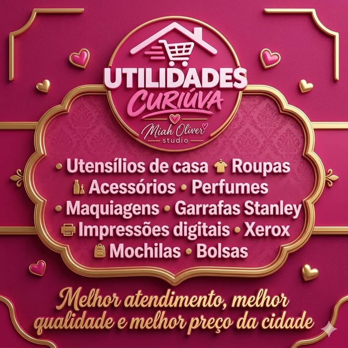

<!DOCTYPE html>
<html lang="pt-BR">
<head>
    <meta charset="UTF-8">
    <meta name="viewport" content="width=device-width, initial-scale=1.0">
    <meta name="description" content="Utilidades Curiúva: casa, roupas, acessórios, perfumes, maquiagens, garrafas Stanley, impressões, Xerox, mochilas e bolsas.">
    <meta name="theme-color" content="#7d1738">
    <title>Utilidades Curiúva | Miah Oliver Studio</title>
    
</head>
<body>
    <header class="site-header" id="inicio">
        <h1>UTILIDADES CURIÚVA</h1>
        
Miah Oliver Studio

    </header>

    <nav class="site-nav" aria-label="Menu principal">
        <a href="#inicio">Início</a>
        <a href="#casa">Casa</a>
        <a href="#roupas">Roupas</a>
        <a href="#acessorios">Acessórios</a>
        <a href="#perfumes">Perfumes</a>
        <a href="#maquiagens">Maquiagens</a>
        <a href="#stanley">Stanley</a>
        <a href="#xerox">Xerox</a>
        <a href="#mochilas">Mochilas</a>
        <a href="#bolsas">Bolsas</a>
    </nav>

    <main>
        <section class="hero" aria-labelledby="hero-title">
            

                
Miah Oliver Studio

                <h2 id="hero-title">Utilidades para o seu dia a dia</h2>
                
Encontre produtos para casa, presentes, acessórios e muito mais. Qualidade, variedade e atendimento feito com carinho.

                

                    <a class="hero-link" href="#categorias">Conheça nossas categorias</a>
                    <a class="whatsapp-link" href="https://wa.me/5541988704110?text=Ol%C3%A1%2C%20quero%20saber%20mais%20sobre%20os%20produtos." target="_blank" rel="noopener noreferrer" aria-label="Fale com a Utilidades Curiúva pelo WhatsApp">Fale pelo WhatsApp</a>
                

            

            
        </section>

        <section class="categories" id="categorias" aria-labelledby="categories-title">
            

                <h2 id="categories-title">O que você encontra</h2>
                
Uma seleção de produtos e serviços para facilitar sua rotina e deixar seus momentos especiais.

            

            

                <article class="category-card" id="casa">
                    <h3>Casa</h3>
                    
Utensílios e itens úteis para o seu lar.

                </article>
                <article class="category-card" id="roupas">
                    <h3>Roupas</h3>
                    
Peças para compor seu estilo.

                </article>
                <article class="category-card" id="acessorios">
                    <h3>Acessórios</h3>
                    
Detalhes e presentes para todas as ocasiões.

                </article>
                <article class="category-card" id="perfumes">
                    <h3>Perfumes</h3>
                    
Fragrâncias para você e para presentear.

                </article>
                <article class="category-card" id="maquiagens">
                    <h3>Maquiagens</h3>
                    
Opções para realçar sua beleza.

                </article>
                <article class="category-card" id="stanley">
                    <h3>Garrafas Stanley</h3>
                    
Garrafas e acessórios para acompanhar sua rotina.

                </article>
                <article class="category-card" id="xerox">
                    <h3>Impressões e Xerox</h3>
                    
Serviços de impressão e cópias digitais.

                </article>
                <article class="category-card" id="mochilas">
                    <h3>Mochilas</h3>
                    
Praticidade para trabalho, estudo e passeios.

                </article>
                <article class="category-card" id="bolsas">
                    <h3>Bolsas</h3>
                    
Modelos para levar seus itens com estilo.

                </article>
            

        </section>
    </main>

    <footer class="site-footer">
        
<strong>Utilidades Curiúva | Miah Oliver Studio</strong>

        
Melhor atendimento, melhor qualidade e melhor preço da cidade.

    </footer>
</body>
</html>
